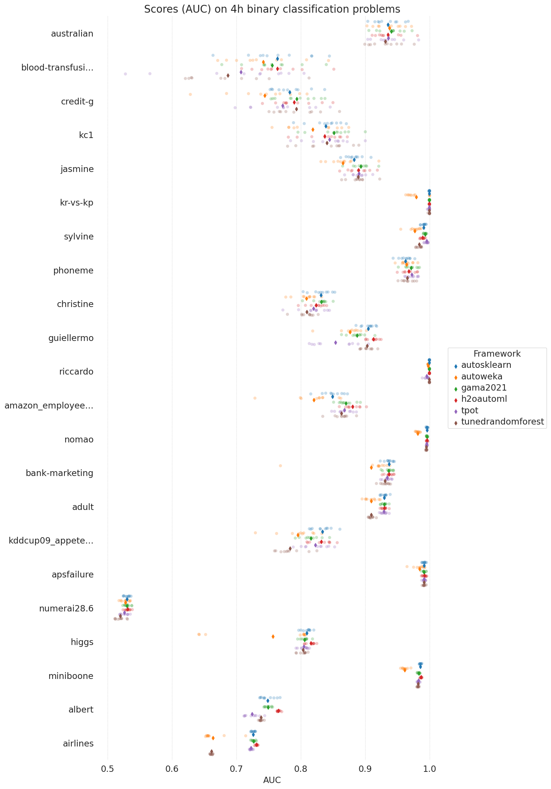
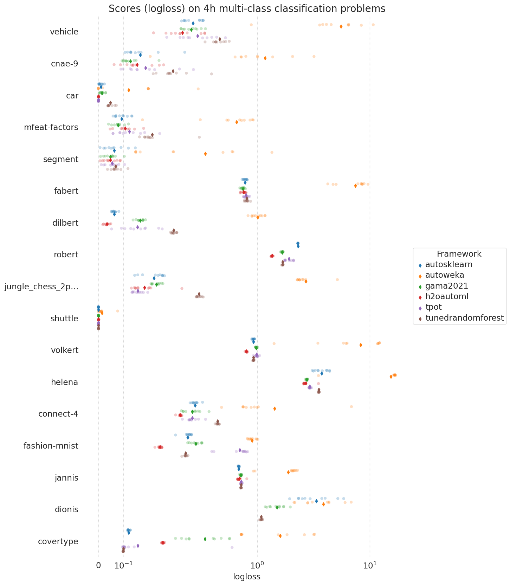

:orphan:

Benchmark Results
=================

This page reports the benchmark results obtained by running GAMA on the `AutoML benchmark <https://openml.github.io/automlbenchmark/automl_overview.html>`_.
Note that the performance of other AutoML frameworks is taken from the original benchmark experiments, they are not reproduced by us.
We will do our best to keep the results complete and up to date.

GAMA 20.2.1
***********
The results are obtained on non-aws hardware.
Additionally, GAMA was ran with a one-hour time constraint instead of four hours, other conditions are equal.
It is important to point out that the constrained runtime might both be bad (less time to search), but also good (less opportunity to overfit).
The restriction is in place due to our compute budget.
The raw data is `here <https://github.com/openml-labs/gama/tree/develop/data/GAMA_20_2_1.csv>`_.

