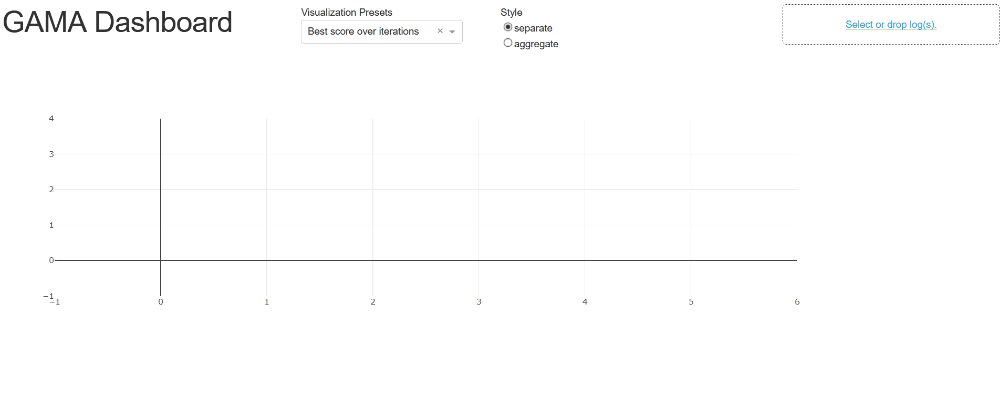
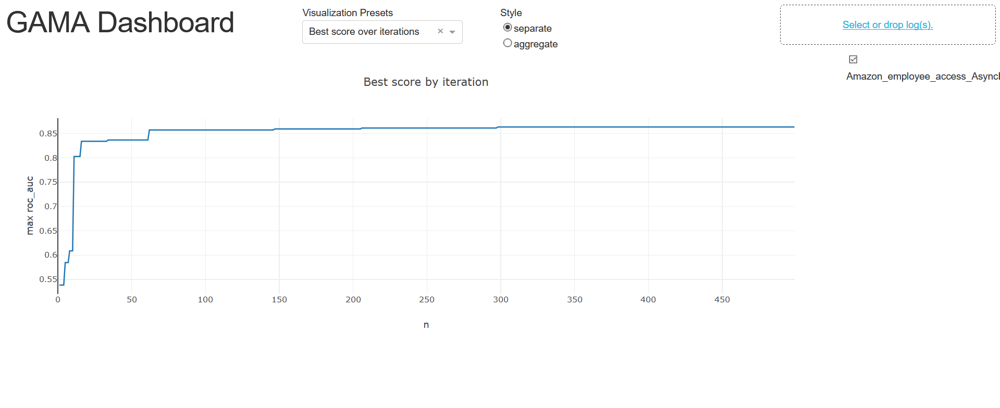

:orphan:

.. _visualization:

Visualization
-------------

.. note::
    The visualization of optimization traces is in an early stages of development (even moreso than the rest of GAMA).
    To be frank, it leaves a lot to be desired.
    That said, it can be very useful to see variance over different GAMA runs, compare optimization methods,
    or see how solution quality improves over time.

If you have installed GAMA with the optional visualization dependencies (``pip install -e .[vis]``),
you can start the dashboard like so::

    from gama.visualization import dash_app
    dash_app.run_server()

A message will be printed on console indicating how to reach the server, e.g.::

    Running on http://127.0.0.1:8050/

Visiting this address in your webbrowser will show the screen below.

Clicking 'Select or drop log(s)' in the top-right corner opens a file explorer which lets you select file(s) to load.
Select a log file generated by a GAMA run, here we use the example log found `here <>`_.
After loading the file, you can toggle its visualization by clicking the checkbox that appears next to the file name.
The first visualization you will see is the best obtained score as a function of the number of evaluated pipelines:

In the top bar you will find a dropdown 'Visualization Presets' which allow you to see other visualizations.
Additionally you can also select whether or not to aggregate statistics across multiple logs.
This is useful when comparing two optimization methods with each other.
Below you will find a description of each preset.

.. warning::
    Aggregating logs will group all logs with the same search method together, even if those logs are executed on
    different datasets or with different hyperparameter configurations.
    Be careful in your selection of visualized logs (use the checklist on the right).
    It is currently not possible to manually define groups, or define how aggregates are computed.

Visualization presets include:

* **#Pipeline by learner** A bar chart of the number of times each estimator is used as the final step in a machine learning pipeline.

* **#Pipeline by size** A bar chart of the distribution of the number of components per evaluated pipeline.

* **Best score over time** The best score obtained by any individual pipeline at a given point in time.

* **Best score over iterations** The best score obtained by any individual pipeline at a given iteration.

* **Size vs Metric** A scatter plot where each pipeline is represented by a marker, gives an impression of the distribution of scores for evaluated pipelines of different lengths.

* **Evaluation Times** A bar chart plotting the distribution of time required to evaluate pipelines during optimization.

* **Evaluations by Rung** (ASHA only) A bar chart plotting the number of evaluations at each ASHA rung.

* **Time by Rung** (ASHA only) A bar chart plotting the combined time used of all evaluations for each ASHA rung.

Finally there is the **custom** option, which lets you define what to put on the axes.
There is no support for aggregating logs in this mode.
